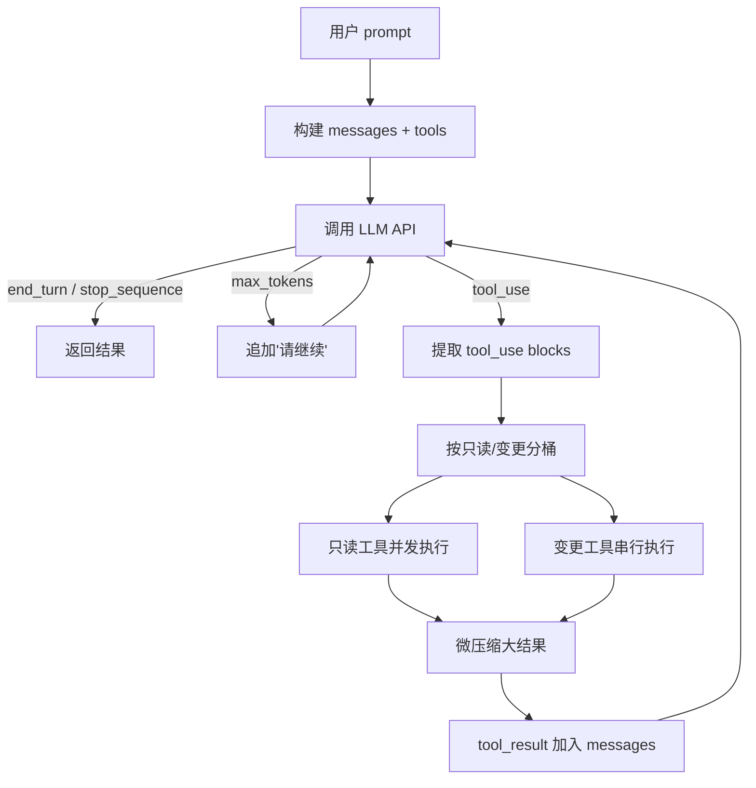

> 本文是「深入 Open Agent SDK (Swift)」系列第一篇。[系列目录见这里](/blog/open-agent-sdk-swift)。

大多数 LLM 封装库做的事情是：发请求、拿响应、结束。但一个真正的 Agent 不止于此——它要能自己判断需不需要调工具、执行完工具后把结果喂回 LLM、循环往复直到拿到最终答案。这个循环就是 **Agent Loop**。

这篇文章分析 [Open Agent SDK (Swift)](https://github.com/terryso/open-agent-sdk-swift) 的 Agent Loop 实现，看它怎样用原生 Swift 并发在进程内跑完一整套循环。

## Agent Loop 是什么？

用一句话概括：**用户发 prompt → LLM 返回响应 → 如果 LLM 要求调工具就执行 → 把工具结果喂回 LLM → 重复，直到 LLM 说"我说完了"**。

画成流程图：



这个循环里有几个关键决策点：

1. **什么时候停？** LLM 返回 `end_turn` 或 `stop_sequence` 时正常结束；到达 `maxTurns` 上限时强制停止；超出预算 (`maxBudgetUsd`) 时中断；用户主动取消时也中断。
2. **工具怎么执行？** 只读工具并发跑（最多 10 个），变更工具串行跑——避免并发写文件。
3. **上下文太长怎么办？** 自动压缩——用一个 LLM 调用把历史摘要，腾出空间继续。
4. **中途出错怎么办？** 内置重试、回退模型、错误隔离（工具报错不会炸掉整个循环）。

## 两条入口：prompt() 和 stream()

SDK 提供两种方式触发 Agent Loop：

### 阻塞式 prompt()

```swift
let agent = createAgent(options: AgentOptions(
    apiKey: "sk-...",
    model: "claude-sonnet-4-6",
    maxTurns: 10
))

let result = await agent.prompt("Read Package.swift and summarize it.")
print(result.text)
print("Turns: \(result.numTurns), Cost: $\(String(format: "%.4f", result.totalCostUsd))")
```

`prompt()` 是"发出去等结果"模式。一次调用跑完所有轮次，返回最终的 `QueryResult`。适合不需要实时看到中间过程的场景——比如后台任务、CLI 工具。

### 流式 stream()

```swift
for await message in agent.stream("Explain this codebase.") {
    switch message {
    case .partialMessage(let data):
        print(data.text, terminator: "")  // 实时输出文本
    case .toolUse(let data):
        print("[Using tool: \(data.toolName)]")
    case .toolResult(let data):
        print("[Tool done, \(data.content.count) chars]")
    case .result(let data):
        print("\nDone: \(data.numTurns) turns, $\(String(format: "%.4f", data.totalCostUsd))")
    default:
        break
    }
}
```

`stream()` 返回 `AsyncStream<SDKMessage>`，在 LLM 处理过程中持续推送事件。SDK 定义了 17 种消息类型，从 `partialMessage`（文本片段）到 `toolUse`（工具调用）到 `result`（最终结果），覆盖了 Agent Loop 的每个阶段。

选择哪种取决于你的 UI 需求：要实时展示就用 `stream()`，不需要就用 `prompt()`。

## 循环体内部：一个 turn 做了什么

不管走哪条入口，每个 turn 的核心逻辑是相同的。让我们跟一遍代码。

### 1. 检查是否需要压缩

```swift
if shouldAutoCompact(messages: messages, model: model, state: compactState) {
    let (newMessages, _, newState) = await compactConversation(
        client: client, model: model,
        messages: messages, state: compactState,
        fileCache: fileCache,
        sessionMemory: sessionMemory
    )
    messages = newMessages
    compactState = newState
}
```

每个 turn 开始前先检查：消息历史估计的 token 数是不是快要撑爆上下文窗口了。如果是，用一个 LLM 调用把历史压缩成摘要，替换掉原始消息。

压缩的阈值是 `模型上下文窗口 - 10000 tokens`（缓冲区）。连续压缩失败 3 次后会停止尝试，避免浪费 token。

### 2. 发 LLM 请求（带重试和回退）

```swift
response = try await withRetry({
    try await client.sendMessage(
        model: model, messages: messages,
        maxTokens: maxTokens, system: buildSystemPrompt(),
        tools: apiTools, ...
    )
}, retryConfig: retryConfig)
```

所有 LLM 请求都经过 `withRetry` 包装，按配置的重试策略处理临时错误（网络超时、429 限流等）。

如果主模型彻底失败，还配置了 `fallbackModel`，SDK 会用备用模型再试一次：

```swift
if let fallbackModel = self.options.fallbackModel, fallbackModel != self.model {
    // 用 fallbackModel 重试...
}
```

### 3. 处理 stop_reason

LLM 响应里的 `stop_reason` 决定了循环的走向：

| stop_reason | 含义 | 循环行为 |
|---|---|---|
| `end_turn` | LLM 说完了 | 正常退出循环 |
| `stop_sequence` | 碰到停止符 | 正常退出循环 |
| `tool_use` | LLM 想调工具 | 执行工具，继续循环 |
| `max_tokens` | 输出被截断 | 追加"请继续"，继续循环 |

`max_tokens` 的情况有个保护：最多自动续接 3 次，防止无限循环。

### 4. 工具执行：分桶并发

当 LLM 返回 `tool_use` 时，SDK 不是简单地把工具排着队一个个跑，而是做了分桶：

```swift
// ToolExecutor.partitionTools()
for block in blocks {
    let tool = tools.first { $0.name == block.name }
    if let tool = tool, tool.isReadOnly {
        readOnly.append(item)   // 只读桶
    } else {
        mutations.append(item)  // 变更桶
    }
}
```

**只读工具**（Read、Glob、Grep、WebSearch 等）可以安全并发，用 `TaskGroup` 跑，最多 10 个一批：

```swift
let batchResults = await withTaskGroup(of: ToolResult.self) { group in
    for item in batchSlice {
        group.addTask {
            await executeSingleTool(block: item.block, tool: item.tool, context: ...)
        }
    }
    // 收集结果
}
```

**变更工具**（Write、Edit、Bash 等）必须串行执行，一个跑完再跑下一个，避免并发写冲突：

```swift
for item in items {
    let result = await executeSingleTool(...)
    results.append(result)
}
```

执行顺序：先跑所有只读工具（并发），再跑所有变更工具（串行）。这在 LLM 一次返回多个工具调用时能显著提升性能——比如 LLM 同时要求读 5 个文件，5 个读操作并行完成。

### 5. 微压缩

工具执行完后，结果在喂回 LLM 之前还要过一道微压缩：

```swift
for result in toolResults {
    let processedContent = await processToolResult(result.content, isError: result.isError)
    processedResults.append(ToolResult(
        toolUseId: result.toolUseId,
        content: processedContent,
        isError: result.isError
    ))
}
```

如果一个工具返回的内容超过 50000 字符（比如读了一个大文件），SDK 会用一次额外的 LLM 调用把内容压缩。错误结果不压缩——保留了完整的错误信息供 LLM 诊断。

## 成本追踪：逐 turn 累加

每一轮 LLM 调用后，SDK 都会更新 token 用量和费用：

```swift
let turnCost = estimateCost(model: model, usage: turnUsage)
totalCostUsd += turnCost
costByModel[model] = CostBreakdownEntry(
    model: model,
    inputTokens: turnUsage.inputTokens,
    outputTokens: turnUsage.outputTokens,
    costUsd: turnCost
)
```

`costByModel` 按 model 分组记录。这意味着如果你中途切换了模型（通过 `switchModel()`），每个模型的费用是分开计算的。最终 `result.costBreakdown` 能告诉你每个模型花了多少钱。

预算检查在每个 turn 后执行：

```swift
if let budget = options.maxBudgetUsd, totalCostUsd > budget {
    status = .errorMaxBudgetUsd
    break
}
```

超出预算时立即退出循环，但已产生的文本会保留在结果里——你拿到的是部分结果，不是空白的。

## 取消：协作式取消

Swift 的结构化并发用 `Task.isCancelled` 做协作式取消。SDK 在循环的多个检查点都检查了这个标志：

1. while 循环入口
2. 只读工具和变更工具之间
3. SSE 事件循环内部
4. 工具执行前后

```swift
// 循环入口
if Task.isCancelled || _interrupted {
    status = .cancelled
    break
}

// 只读/变更之间
if Task.isCancelled { return results }
```

`stream()` 还额外支持通过 `interrupt()` 方法取消——内部就是 cancel 掉持有 stream 的 Task。

取消后返回的是 `QueryResult(isCancelled: true)`，附带截止到取消时刻的部分文本和 token 用量。

## 错误处理：不炸、不丢

SDK 的错误处理原则是：**工具执行错误不传播，API 错误有重试，最终失败保留部分结果**。

工具执行时，任何错误都被捕获为 `ToolResult(isError: true)`：

```swift
static func executeSingleTool(...) async -> ToolResult {
    guard let tool = tool else {
        return ToolResult(toolUseId: block.id, content: "Error: Unknown tool", isError: true)
    }
    // ... try executing
    let result = await tool.call(input: block.input, context: context)
    return ToolResult(toolUseId: block.id, content: result.content, isError: result.isError)
}
```

工具报错的结果照样喂回 LLM，LLM 看到错误信息后可以决定换个策略。Agent Loop 不会因为一个工具挂了就崩溃。

API 层面的错误（网络问题、500 等）会触发重试；重试失败后触发 fallback 模型；全挂了才返回 `errorDuringExecution` 状态。

## Hook 集成：循环的生命周期

Agent Loop 在关键节点触发 Hook 事件：

| Hook 事件 | 触发时机 |
|---|---|
| `sessionStart` | 循环开始前 |
| `preToolUse` | 每个工具执行前 |
| `postToolUse` | 工具成功执行后 |
| `postToolUseFailure` | 工具执行失败后 |
| `stop` | 循环结束时（正常或异常） |
| `sessionEnd` | 返回结果前 |

Hook 的一个典型用法是在 `preToolUse` 拦截危险操作：

```swift
await hookRegistry.register(.preToolUse, definition: HookDefinition(
    matcher: "Bash",
    handler: { input in
        return HookOutput(message: "Bash blocked in production", block: true)
    }
))
```

被 Hook 拦截的工具不会执行，而是返回一个错误结果——LLM 会看到"Bash blocked in production"，可以换个方式完成任务。

## 还有一个入口：streamInput()

除了 `prompt()` 和 `stream()`，SDK 还提供了第三种入口——`streamInput()`，接受一个 `AsyncStream<String>` 作为输入：

```swift
let input = AsyncStream<String> { continuation in
    continuation.yield("What's in this project?")
    continuation.yield("Now explain the test structure.")
    continuation.finish()
}

for await message in agent.streamInput(input) {
    // 处理每条输入对应的响应
}
```

每个输入元素被视为一条新的用户消息，触发一个完整的 prompt 周期。这适合聊天式交互：用户的每条消息都是输入流的一个元素，Agent 逐条处理并流式输出。

## 小结

Agent Loop 是整个 SDK 的心脏。理解了它的工作方式，剩下的功能都是在它的基础上叠加的：

- **工具系统** — Loop 里的"执行工具"环节
- **MCP 集成** — Loop 启动时连接外部工具服务器
- **会话持久化** — Loop 结束后保存 messages 数组
- **权限控制** — 工具执行前的拦截点
- **Hook 系统** — Loop 生命周期的事件回调

下一篇我们深入 **工具系统**：34 个内置工具怎么组织、`ToolProtocol` 协议的设计思路、以及怎么用 `defineTool` 创建自定义工具。

---

**系列文章**：

- **第 0 篇**：[Open Agent SDK (Swift)：用原生 Swift 并发构建 AI Agent 应用](/blog/open-agent-sdk-swift)
- **第 1 篇**：Agent Loop 内核：从 prompt 到多轮对话的完整运转机制（本文）
- **第 2 篇**：34 个工具的背后：工具协议、三层架构与自定义扩展（下一篇）

**GitHub**：[terryso/open-agent-sdk-swift](https://github.com/terryso/open-agent-sdk-swift)
