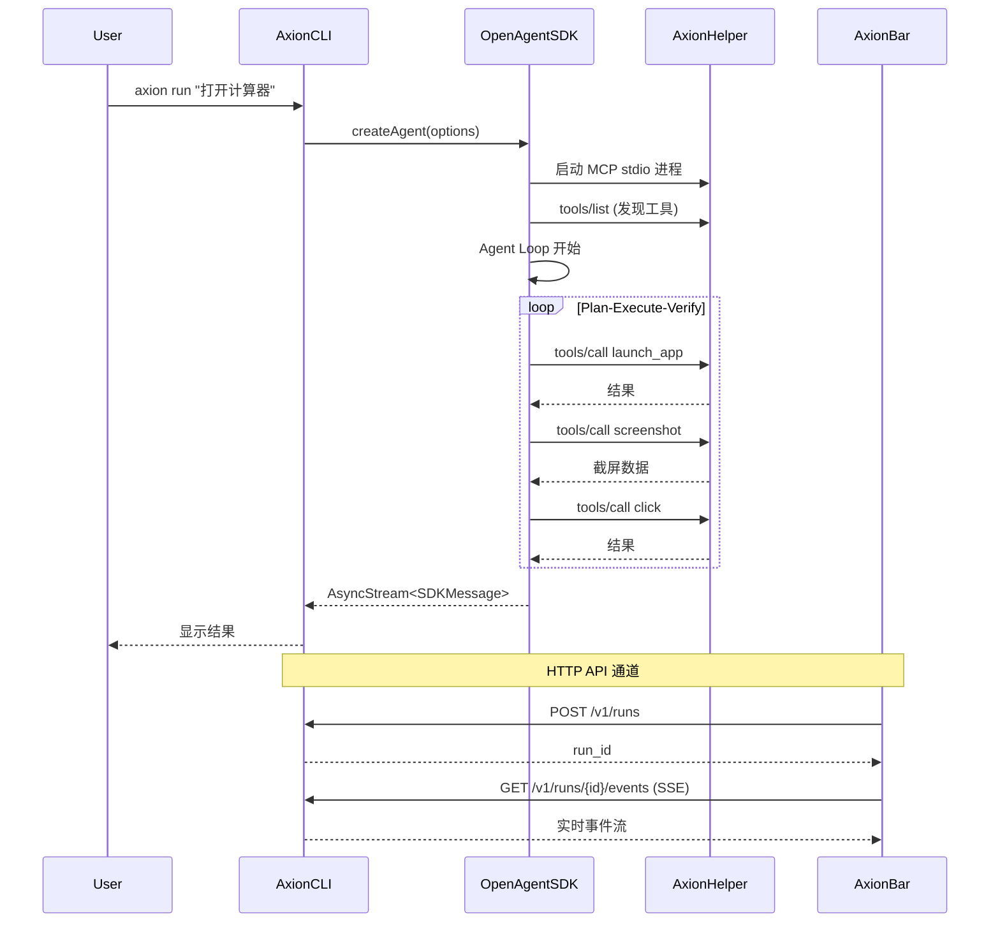

上一篇我们体验了 Axion 的基本用法。这次深入代码，看看它是怎么搭起来的。

Axion 的架构可以用一张图说清楚：

```
┌───────────────────────────────────────────────────────┐
│                       AxionCLI                         │
│  run / setup / doctor / server / mcp / record / skill  │
│  Plan → Execute → Verify → Replan Loop                 │
│  Memory · Fast Mode · Takeover                         │
├──────────────────┬──────────────────┬─────────────────┤
│    AxionCore     │   AxionHelper    │    AxionBar      │
│  Models, Proto-  │  MCP Server      │  Menu Bar App    │
│  cols, Config,   │  21 Native macOS │  Task Panel      │
│  Errors          │  Tools           │  Global Hotkeys  │
└──────────────────┴──────────────────┴─────────────────┘
```

四个模块，各司其职，通过 MCP 协议跨进程通信。

## 模块一：AxionCore — 共享基础层

AxionCore 是所有其他模块的公共依赖，但它本身非常薄。只包含三样东西：

**模型定义：**

```swift
// Plan — 一次任务计划
public struct Plan: Codable, Equatable {
    public let id: UUID
    public let task: String           // 自然语言任务描述
    public let steps: [Step]          // 执行步骤列表
    public let stopWhen: [StopCondition]  // 停止条件
    public let maxRetries: Int
}

// Step — 一个执行步骤
public struct Step: Codable, Equatable {
    public let index: Int
    public let tool: String           // 调用哪个 MCP 工具
    public let parameters: [String: Value]
    public let purpose: String        // 为什么做这一步
    public let expectedChange: String // 预期结果
}

// RunState — 状态机的所有状态
public enum RunState: String, Codable {
    case planning     // 正在规划
    case executing    // 正在执行
    case verifying    // 正在验证
    case replanning   // 正在重新规划
    case done         // 完成
    case blocked      // 受阻
    case needsClarification  // 需要人工确认
    case cancelled    // 已取消
    case failed       // 失败
}
```

**协议定义：**

AxionCore 定义了 `PlannerProtocol`、`ExecutorProtocol`、`VerifierProtocol` 三个核心协议。这是经典的依赖倒置——上层模块（CLI）依赖抽象接口而非具体实现。

**错误类型：**

`AxionError` 枚举覆盖了所有错误场景：`planningFailed`、`executionFailed`、`verificationFailed`、`stepBudgetExceeded`、`maxRetriesExceeded` 等。

**关键设计决策：** AxionCore 不依赖 OpenAgentSDK，也不 import 任何外部框架。它是纯模型层，只做数据结构定义。这意味着 AxionBar 可以只 import AxionCore 来共享模型，而不需要拉入整个 SDK。

## 模块二：AxionHelper — MCP 工具服务端

AxionHelper 是一个独立的可执行进程，充当 MCP Server，通过 stdio 协议提供 21 个原生 macOS 自动化工具。

它接收 MCP 工具调用请求，执行对应的 macOS 操作，返回结果。

### 为什么是独立进程？

AxionHelper 作为独立进程运行，主要出于三个考虑：

**权限隔离。** macOS 的辅助功能（Accessibility）权限是按进程授权的。如果 AxionHelper 和 CLI 跑在同一个进程里，每次 CLI 重启都需要重新授权。独立进程只需要授权一次。

**稳定性。** 原生桌面操作（CGEvent 点击、AX API 调用）有时会触发意外的系统行为。独立进程意味着 Helper 崩溃不会拖垮整个 Agent。

**可复用。** AxionHelper 可以独立运行，不需要 AxionCLI。任何 MCP 客户端（Claude Code、Cursor、甚至自定义 Agent）都可以直接调用它的工具：

```json
{
  "mcpServers": {
    "axion": {
      "command": "/path/to/AxionHelper"
    }
  }
}
```

### 工具注册

AxionHelper 使用 `swift-mcp` SDK 的 `MCPTool` 宏来注册工具。21 个工具按功能分组：

| 分类 | 工具 | 说明 |
|------|------|------|
| 应用管理 | `launch_app` | 启动应用，自动检测阻塞对话框 |
| | `list_apps` | 列出运行中的应用 |
| | `activate_window` | 激活窗口（置顶） |
| 窗口管理 | `list_windows` | 列出窗口（可按 pid 过滤） |
| | `get_window_state` | 获取窗口状态 |
| | `resize_window` | 移动/调整窗口大小 |
| | `validate_window` | 检查窗口是否可操作 |
| | `arrange_windows` | 排列多窗口（并排/级联） |
| 鼠标 | `click` / `double_click` / `right_click` | 坐标或 AX 选择器点击 |
| | `drag` | 拖拽 |
| | `scroll` | 滚动 |
| 键盘 | `type_text` | 输入文本 |
| | `press_key` | 按键 |
| | `hotkey` | 快捷键组合 |
| 屏幕 | `screenshot` | 截屏 |
| | `get_accessibility_tree` | 获取 AX 元素树 |
| | `open_url` | 打开 URL |
| 录制 | `start_recording` / `stop_recording` | 捕获用户操作事件 |

### 元素发现策略

工具中值得一提的是 **AX 选择器**机制。传统的桌面自动化靠坐标定位元素——窗口一移动就失效。Axion 支持两种模式：

**选择器模式（推荐）：**

```json
{
  "pid": 12345,
  "window_id": 42,
  "__selector": {
    "title": "OK",
    "role": "AXButton"
  }
}
```

通过无障碍属性（标题、角色、AX ID）匹配元素，不怕窗口移动或缩放。

**坐标模式（兜底）：**

当 AX 树不包含目标元素时（比如 WebKit 内容、游戏画面），退回到从 AX 树读取 bounds 计算中心坐标。原则是：**绝不猜测坐标**，总是从 AX 树推导。

## 模块三：AxionCLI — 大脑中枢

AxionCLI 是整个系统的入口，也是 LLM 交互的核心。它依赖 OpenAgentSDK 来编排 Agent Loop。

### CLI 命令体系

AxionCLI 提供了 7 个子命令：

```
axion run "task"       # 执行任务（核心命令）
axion setup            # 交互式配置
axion doctor           # 环境检查
axion server --port N  # 启动 HTTP API 服务
axion mcp              # 启动 MCP Server 模式
axion record "name"    # 开始录制操作
axion skill ...        # 管理技能（compile/run/list/delete）
```

### 内部模块划分

AxionCLI 内部按职责划分为多个子目录：

```
AxionCLI/
├── Commands/      # CLI 子命令（run, setup, doctor, server, mcp, record, skill）
├── Config/        # 配置管理（分层：默认值 → config.json → 环境变量 → CLI 参数）
├── Permissions/   # macOS 权限检查
├── Engine/        # RunEngine 状态机
├── Planner/       # LLMPlanner, PromptBuilder, PlanParser
├── Executor/      # StepExecutor, SafetyChecker
├── Verifier/      # TaskVerifier, StopConditionEvaluator
├── Memory/        # 跨任务记忆（提取、分析、注入）
├── Trace/         # JSONL 事件追踪
├── MCP/           # Agent-as-MCP-Server
├── API/           # HTTP API + SSE 事件流
├── Helper/        # Helper 进程生命周期管理
└── Services/      # 技能执行、录制编译
```

### 与 SDK 的协作

AxionCLI 使用 OpenAgentSDK 的标准流程：

```
1. ConfigManager.load()           → 加载配置
2. HelperPathResolver.resolve()   → 定位 Helper 可执行文件
3. PromptBuilder.load()           → 加载 system prompt（Markdown 模板）
4. McpStdioConfig(command:)       → 配置 Helper 为 MCP stdio server
5. HookRegistry + preToolUse      → 注册安全 Hook
6. AgentOptions(...)              → 配置 Agent 参数
7. createAgent(options:)          → 创建 Agent 实例
8. agent.stream(task)             → 启动流式执行
9. for await message in stream    → 消费 AsyncStream<SDKMessage>
```

SDK 负责 Agent Loop、MCP Client、Hooks 等通用能力；Axion 负责 Planner、Verifier、Memory 等应用特有逻辑。

## 模块四：AxionBar — 菜单栏 UI

AxionBar 是一个原生 macOS 菜单栏应用（SwiftUI），提供不需要终端的操作方式。

它的结构：

```
AxionBar/
├── Views/              # QuickRunWindow, TaskDetailPanel, RunHistoryWindow
├── MenuBar/            # MenuBarBuilder
├── Services/           # SSEEventClient, BackendHealthChecker, GlobalHotkeyService
└── Models/             # Bar 专用模型
```

**关键边界决策：** AxionBar 只 import `AxionCore`（共享模型），不 import `OpenAgentSDK`。它通过 HTTP API（`localhost:4242`）与 AxionCLI 后端通信，不经过 MCP stdio。

这意味着菜单栏应用和 CLI 后端是完全解耦的——你可以关掉菜单栏应用，CLI 照常工作；也可以让菜单栏应用连接到远程的 Axion 服务实例。

## 进程间通信

整个系统的进程通信可以用一张时序图描述：



两条通信路径：

1. **MCP stdio** — CLI ↔ Helper，双向二进制流，SDK 自动管理进程生命周期
2. **HTTP API** — Bar → CLI，REST + SSE，标准 Web 协议

## SDK vs 应用层边界

整个架构中有一个反复出现的主题：**什么属于 SDK，什么属于应用层**。

| 归属 SDK | 归属应用层 |
|----------|-----------|
| Agent Loop 编排 | Planner 规划策略 |
| MCP Client 协议 | Verifier 验证逻辑 |
| 工具注册框架 | 21 个桌面操作工具 |
| Hooks 系统 | 安全检查规则 |
| 流式消息管道 | Trace JSONL 格式 |
| Memory 存储 | 记忆提取策略 |

一句话总结：**SDK 管通用的，Axion 管特有的。**

Agent Loop 怎么转、MCP 消息怎么传、Hook 怎么拦截——这些是通用问题，SDK 解决。但"规划什么步骤"、"怎么验证成功"、"提取什么经验"——这些是 Axion 特有的，应用层自己管。

## 下一步

架构看完了，下一篇我们钻进最核心的部分——Plan-Execute-Verify 循环。看看 Axion 如何把一句自然语言变成一系列桌面操作，失败了又如何自动恢复。

---

**深入 Axion 桌面自动化平台系列文章**：

- **第 1 篇**：[Axion 入门：用自然语言控制你的 Mac](/blog/axion-desktop-automation-intro)
- **第 2 篇**：Axion 架构解析：四模块设计与 MCP 协议（本文）
- **第 3 篇**：[Axion 核心引擎：Plan-Execute-Verify 循环](/blog/axion-plan-execute-verify-engine)
- **第 4 篇**：[Axion 记忆与技能：越用越聪明的桌面助手](/blog/axion-memory-and-skills)
- **第 5 篇**：[Axion 集成生态：从命令行到全平台](/blog/axion-integration-ecosystem)

**GitHub**：[terryso/axion](https://github.com/terryso/axion)
