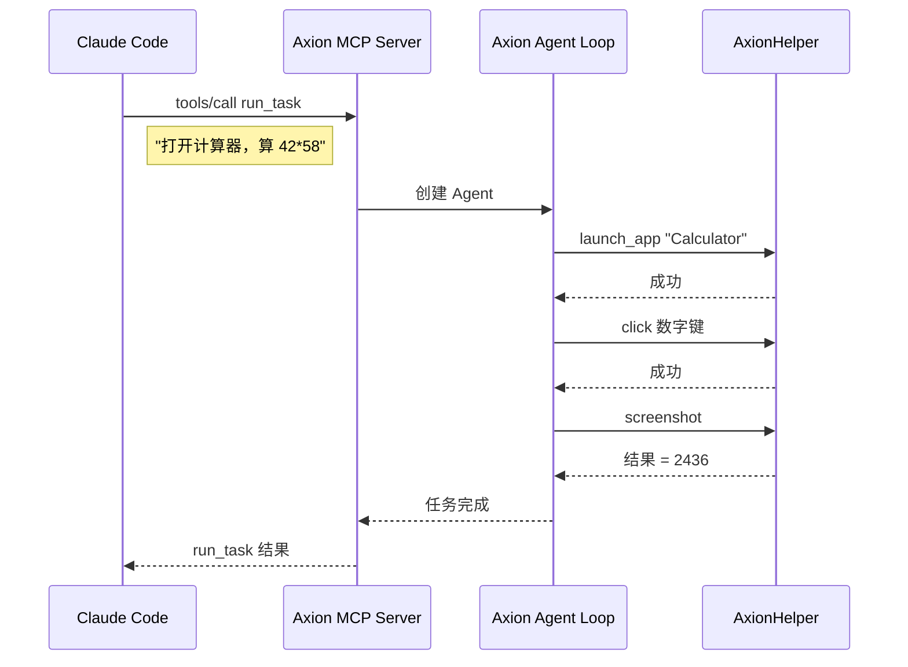

前四篇我们一直在终端里用 Axion。但 Axion 的设计意图是成为 macOS 桌面操作的**基础设施层**——它应该能被任何需要桌面操作的程序调用。

这篇文章看 Axion 的三种集成模式，以及它背后更大的 OpenAgentSDK 生态。

## 集成模式一：HTTP API 服务

把 Axion 跑成后台服务，其他程序通过 REST API 提交任务：

```bash
# 启动 API 服务
axion server --port 4242

# 带认证
axion server --port 4242 --auth-key mysecret

# 限制并发（防止同时操作桌面互相干扰）
axion server --port 4242 --max-concurrent 3
```

### 四个 API 端点

| 方法 | 路径 | 说明 |
|------|------|------|
| `GET` | `/v1/health` | 健康检查 |
| `POST` | `/v1/runs` | 提交任务 |
| `GET` | `/v1/runs/{id}` | 查询任务状态 |
| `GET` | `/v1/runs/{id}/events` | SSE 实时事件流 |

### 提交任务

```bash
curl -X POST http://localhost:4242/v1/runs \
  -H "Content-Type: application/json" \
  -d '{"task": "打开计算器并计算 42 * 58"}'
```

返回：

```json
{
  "id": "20260516-ab3k7m",
  "status": "running",
  "task": "打开计算器并计算 42 * 58"
}
```

### 查询状态

```bash
curl http://localhost:4242/v1/runs/20260516-ab3k7m
```

```json
{
  "id": "20260516-ab3k7m",
  "status": "done",
  "task": "打开计算器并计算 42 * 58",
  "steps_executed": 8,
  "replan_count": 0,
  "duration_ms": 12400
}
```

### SSE 实时事件流

通过 Server-Sent Events 实时接收任务执行进度：

```bash
curl -N http://localhost:4242/v1/runs/20260516-ab3k7m/events
```

```
event: state_change
data: {"from": "planning", "to": "executing"}

event: tool_call
data: {"tool": "launch_app", "arguments": {"app_name": "Calculator"}}

event: tool_result
data: {"tool": "launch_app", "success": true}

event: state_change
data: {"from": "executing", "to": "verifying"}

event: state_change
data: {"from": "verifying", "to": "done"}
```

这让前端 UI 可以实时显示 Agent 的每一步操作——正在点击什么、执行到了哪一步、是否需要重新规划。

### 并发控制

`ConcurrencyLimiter` 确保同一时间只有指定数量的任务在执行桌面操作。这很关键——桌面是单用户环境，多个 Agent 同时操作鼠标和键盘必然互相干扰。

### 认证

`AuthMiddleware` 支持 API Key 认证。请求头需要带 `Authorization: Bearer <key>`。这对于把 Axion 暴露到网络上的场景很重要。

## 集成模式二：MCP Server

Axion 可以把自己变成一个 MCP Server，让其他 Agent（如 Claude Code、Cursor）直接调用它的桌面操作能力。

```bash
# 启动 MCP stdio 服务
axion mcp
```

在 Claude Code 的 MCP 配置中添加：

```json
{
  "mcpServers": {
    "axion": {
      "command": "/path/to/axion",
      "args": ["mcp"]
    }
  }
}
```

之后 Claude Code 就可以直接调用 Axion 的桌面操作能力了。

### Agent-as-MCP-Server 架构

这比单纯的工具暴露更复杂。Axion MCP Server 暴露的是两个**任务级工具**：

- `run_task` — 提交一个自然语言任务，Axion 内部的 Agent Loop 完成规划和执行
- `query_task_status` — 查询任务状态



外部 Agent 只需要说"做什么"，Axion 内部的 Agent 决定"怎么做"。这是两层 Agent 的嵌套——外部 Agent 做高层决策，Axion Agent 做桌面级执行。

`TaskQueue` 管理任务的排队和执行，确保 MCP Server 不会因为并发请求而崩溃。

## 集成模式三：菜单栏应用

AxionBar 是原生 macOS 菜单栏应用（SwiftUI），提供不打开终端的使用方式。

### 功能

- **快速执行** — 菜单栏直接输入任务描述
- **任务面板** — 通过 SSE 实时显示执行进度
- **技能触发** — 一键执行已保存的技能
- **全局热键** — 为常用技能绑定键盘快捷键
- **运行历史** — 查看最近任务的结果

### 架构

AxionBar 的结构：

```
AxionBar/
├── Views/              # SwiftUI 窗口视图
│   ├── QuickRunWindow  # 快速执行
│   ├── TaskDetailPanel # 任务详情
│   ├── RunHistoryWindow # 历史记录
│   └── SettingsWindow  # 设置
├── MenuBar/            # MenuBarBuilder — 菜单栏构建
├── Services/           # 后端通信
│   ├── SSEEventClient  # SSE 事件客户端
│   ├── BackendHealthChecker  # 后端健康检查
│   └── GlobalHotkeyService   # 全局热键
└── Models/             # 状态模型
    ├── ConnectionState # 后端连接状态
    ├── HotkeyConfig    # 热键配置
    └── SkillModels     # 技能展示模型
```

AxionBar 只依赖 `AxionCore`（共享模型），不依赖 `OpenAgentSDK`。所有与后端的交互都通过 HTTP API，不是 MCP。这意味着菜单栏应用和 CLI 后端完全解耦。

AxionBar 会通过 `BackendHealthChecker` 定期检查后端是否在线。如果后端没启动，菜单栏会显示"未连接"状态。

## OpenAgentSDK 生态

Axion 不只是一个独立项目——它是 [OpenAgentSDK](https://github.com/terryso/open-agent-sdk-swift) 的旗舰参考实现。

### SDK 提供什么

OpenAgentSDK 为构建 AI Agent 应用提供通用基础设施：

- **Agent Loop** — turn 管理、tool_use 分发的标准编排
- **MCP Client** — 连接、工具发现、工具调用的标准实现
- **Hooks 系统** — 22 个生命周期事件的拦截框架
- **Memory Store** — 跨运行记忆的存储接口
- **AgentMCPServer** — 将 Agent 暴露为 MCP Server 的框架
- **Pause Protocol** — 用户接管的标准机制

### 第三方开发者可以做什么

基于 Axion 和 OpenAgentSDK 的架构，第三方开发者可以：

**创建自定义 Agent：**

```bash
# 使用 SDK 的 ScaffoldCLI 生成项目模板
# basic: 最小 Agent 骨架
# mcp-integration: 集成 Axion 桌面操作能力
```

**注册自定义工具：**

使用 `@Tool` 宏或 `defineTool()` 定义自己的工具，和 Axion 的 21 个桌面工具一起被 Agent 调用。

**集成 Axion 的桌面能力：**

任何 MCP 客户端都可以通过 `axion mcp` 或直接使用 `AxionHelper` 获得桌面操作能力——不需要自己实现 Accessibility API 调用。

### SDK 和应用层的边界

SDK 和应用层的边界在 Axion 的实现中非常清晰：

| SDK 负责 | 应用层负责 |
|----------|-----------|
| Agent 怎么转 | 转什么（规划策略） |
| MCP 消息怎么传 | 传什么（工具定义） |
| Hook 怎么拦截 | 拦截什么（安全规则） |
| 记忆怎么存取 | 存什么取什么（经验提取） |
| MCP Server 怎么跑 | 暴露什么工具 |

这种分层让 SDK 可以服务不同类型的 Agent 应用，而 Axion 专注于桌面自动化这个垂直领域。

## 端到端验证：真实世界的表现

在结束系列之前，回顾一下 Axion 在端到端测试中的真实表现（macOS 15.7.3 环境）：

| 场景 | 任务 | 工具链 | 结果 |
|------|------|--------|------|
| Calculator | "计算 17×23" | launch_app → screenshot → click×10 → hotkey → press_key → type_text | 391 ✓ |
| TextEdit | "输入 Hello World" | launch_app → screenshot → list_windows → get_accessibility_tree → hotkey(cmd+n) → click → type_text | Hello World ✓ |
| Finder | "进入下载目录" | hotkey(cmd+space) → type_text("Finder") → hotkey(cmd+shift+g) → type_text("~/Downloads") | 下载目录 ✓ |
| Safari | "访问 example.com" | launch_app → open_url | example.com ✓ |

测试中的几个发现：
- **Calculator 用了 90 个 trace 事件**——因为 Agent 需要探索按钮布局、尝试失败后重新定位
- **Safari 只用了 10 个事件**——`open_url` 一个工具就搞定了
- **Agent 自纠错**——Calculator 场景中，Agent 先尝试 click 失败，自动切换策略后成功
- **TextEdit 使用了 AX Tree**——Agent 正确地通过 `get_accessibility_tree` 找到 AXTextArea 并输入

## 总结

五篇文章，我们从一个简单的 `axion run` 命令，一路看到了 Axion 的完整设计：

1. **入门** — 自然语言控制 Mac，Plan-Execute-Verify 循环，用户接管
2. **架构** — CLI/Core/Helper/Bar 四模块，MCP stdio 跨进程通信，SDK 边界
3. **引擎** — 状态机流转，System Prompt 引导，失败恢复和重规划
4. **记忆与技能** — 跨任务经验积累，录制回放，从探索到自动化
5. **集成** — HTTP API、MCP Server、菜单栏应用、OpenAgentSDK 生态

Axion 的思路是：**用 SDK 做通用编排，用 MCP 做工具通信，用领域知识做智能规划**——专注在 macOS 桌面自动化这一件事上。

如果你对桌面自动化或 MCP 协议感兴趣，可以在 [GitHub](https://github.com/terryso/axion) 上查看源码，或者直接用 `AxionHelper` 作为你项目的 MCP 工具服务端。

---

**深入 Axion 桌面自动化平台系列文章**：

- **第 1 篇**：[Axion 入门：用自然语言控制你的 Mac](/blog/axion-desktop-automation-intro)
- **第 2 篇**：[Axion 架构解析：四模块设计与 MCP 协议](/blog/axion-architecture-four-modules)
- **第 3 篇**：[Axion 核心引擎：Plan-Execute-Verify 循环](/blog/axion-plan-execute-verify-engine)
- **第 4 篇**：[Axion 记忆与技能：越用越聪明的桌面助手](/blog/axion-memory-and-skills)
- **第 5 篇**：Axion 集成生态：从命令行到全平台（本文）

**GitHub**：[terryso/axion](https://github.com/terryso/axion)
